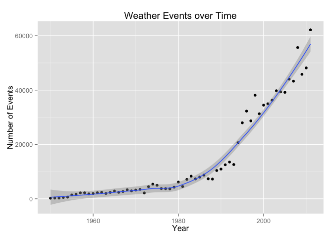
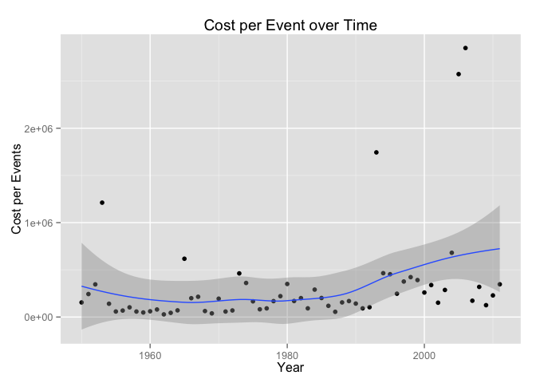
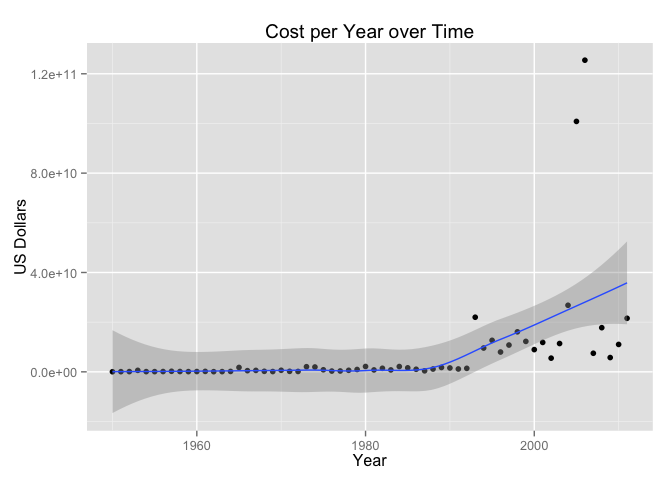

# Project 2 -- Impact of WEATHER EVENTS in the US over Time
Bill Tihen  
Dec 21, 2014  

**For the course: Reproducable Data -- Project 2 -- Due Dec 21, 2014**

## Synopsis

This study from 1950 until 2011 studies the impact of health and the cost damage caused by weather events.  The data is presented in a variety of ways, so that public officals across the US can make appropriate decision based on the weather events in the local area.

**The following list actionable observations that can be used by public officials for planning** 

* areas near the coast are have the highest costs and health effects per event (hurricanes, tropical storms, tsunamis and tidal events are the most expensive per event), thus proper planning needs to be done so that emergencies services can handle large infrequent influxes -- probably in nearby, but inland areas less affect by the coastal events.  
* areas affected by tornados have the highest death and injury rates (because of the many weather events with small impact), thus proper emergency medical for frequent, but small numbers of injuries need to be planned.  
* areas affected by high heat, droughts and floods can expect signifigant health events (both injuries and deaths) and damages (both crop and property).  It may be worth investigating if most heat and drought related injuries can be prevented.  
* the number of events per year is increasing considerably -- this may mean that emergency response staff may have less recovery time between events.
* damages per year has been increasing since 1990, however, the years with very high expenses has increased in both magnitude and frequency since 1990 too -- thus it seems emergency response budgets will need to be increased at a corresponding rate.
* damages per event may be on the increase since 1990, and the very damaging events (outliers), have increased -- thus a relatively large worse case fiscal plan (on top of the normal emergency response budget) may be prudent.

**See the results section to view the supporting data.**

## Processing

1. **Load helpful libraries**


```r
suppressWarnings(suppressMessages( library(plyr) ))
suppressWarnings(suppressMessages( library(knitr) ))
suppressWarnings(suppressMessages( library(ggplot2) ))
suppressWarnings(suppressMessages( library(data.table) ))
```


2. **Get and read the file:**


```r
# define the data path, filename and URL to be downloaded
data_path = "data"
download_file = "storm-data.csv.bz2"
download_file_path = file.path( data_path, download_file )
url = "https://d396qusza40orc.cloudfront.net/repdata%2Fdata%2FStormData.csv.bz2"

# create the data folfder if it doesnt exist
if (!(file.exists( data_path ))) {
  dir.create( data_path, showWarnings = FALSE )
} 

# download the file to the data directory if it is not there
if (!(file.exists( download_file_path ))) {
  download.file(url, download_file_path, method="curl")
}
# read the file
raw_data <- read.table(bzfile( download_file_path ), sep=",", head=TRUE)
```

3. **Check that event labels are consistent with the 40+ NOA Standard events** listed at: https://d396qusza40orc.cloudfront.net/repdata%2Fpeer2_doc%2Fpd01016005curr.pdf


```r
# load into a data table - as it is easy to work with and fast to load
events_dt <- data.table(raw_data)

# how many data entries
events_total <- nrow( events_dt)
events_total
```

```
## [1] 902297
```

```r
# check the event_types -- do they match NOA definitions?
levels( events_dt$EVTYPE )
```

```
##   [1] "   HIGH SURF ADVISORY"          " COASTAL FLOOD"                
##   [3] " FLASH FLOOD"                   " LIGHTNING"                    
##   [5] " TSTM WIND"                     " TSTM WIND (G45)"              
##   [7] " WATERSPOUT"                    " WIND"                         
##   [9] "?"                              "ABNORMAL WARMTH"               
##  [11] "ABNORMALLY DRY"                 "ABNORMALLY WET"                
##  [13] "ACCUMULATED SNOWFALL"           "AGRICULTURAL FREEZE"           
##  [15] "APACHE COUNTY"                  "ASTRONOMICAL HIGH TIDE"        
##  [17] "ASTRONOMICAL LOW TIDE"          "AVALANCE"                      
##  [19] "AVALANCHE"                      "BEACH EROSIN"                  
##  [21] "Beach Erosion"                  "BEACH EROSION"                 
##  [23] "BEACH EROSION/COASTAL FLOOD"    "BEACH FLOOD"                   
##  [25] "BELOW NORMAL PRECIPITATION"     "BITTER WIND CHILL"             
##  [27] "BITTER WIND CHILL TEMPERATURES" "Black Ice"                     
##  [29] "BLACK ICE"                      "BLIZZARD"                      
##  [31] "BLIZZARD AND EXTREME WIND CHIL" "BLIZZARD AND HEAVY SNOW"       
##  [33] "Blizzard Summary"               "BLIZZARD WEATHER"              
##  [35] "BLIZZARD/FREEZING RAIN"         "BLIZZARD/HEAVY SNOW"           
##  [37] "BLIZZARD/HIGH WIND"             "BLIZZARD/WINTER STORM"         
##  [39] "BLOW-OUT TIDE"                  "BLOW-OUT TIDES"                
##  [41] "BLOWING DUST"                   "blowing snow"                  
##  [43] "Blowing Snow"                   "BLOWING SNOW"                  
##  [45] "BLOWING SNOW & EXTREME WIND CH" "BLOWING SNOW- EXTREME WIND CHI"
##  [47] "BLOWING SNOW/EXTREME WIND CHIL" "BREAKUP FLOODING"              
##  [49] "BRUSH FIRE"                     "BRUSH FIRES"                   
##  [51] "COASTAL  FLOODING/EROSION"      "COASTAL EROSION"               
##  [53] "Coastal Flood"                  "COASTAL FLOOD"                 
##  [55] "coastal flooding"               "Coastal Flooding"              
##  [57] "COASTAL FLOODING"               "COASTAL FLOODING/EROSION"      
##  [59] "Coastal Storm"                  "COASTAL STORM"                 
##  [61] "COASTAL SURGE"                  "COASTAL/TIDAL FLOOD"           
##  [63] "COASTALFLOOD"                   "COASTALSTORM"                  
##  [65] "Cold"                           "COLD"                          
##  [67] "COLD AIR FUNNEL"                "COLD AIR FUNNELS"              
##  [69] "COLD AIR TORNADO"               "Cold and Frost"                
##  [71] "COLD AND FROST"                 "COLD AND SNOW"                 
##  [73] "COLD AND WET CONDITIONS"        "Cold Temperature"              
##  [75] "COLD TEMPERATURES"              "COLD WAVE"                     
##  [77] "COLD WEATHER"                   "COLD WIND CHILL TEMPERATURES"  
##  [79] "COLD/WIND CHILL"                "COLD/WINDS"                    
##  [81] "COOL AND WET"                   "COOL SPELL"                    
##  [83] "CSTL FLOODING/EROSION"          "DAM BREAK"                     
##  [85] "DAM FAILURE"                    "Damaging Freeze"               
##  [87] "DAMAGING FREEZE"                "DEEP HAIL"                     
##  [89] "DENSE FOG"                      "DENSE SMOKE"                   
##  [91] "DOWNBURST"                      "DOWNBURST WINDS"               
##  [93] "DRIEST MONTH"                   "Drifting Snow"                 
##  [95] "DROUGHT"                        "DROUGHT/EXCESSIVE HEAT"        
##  [97] "DROWNING"                       "DRY"                           
##  [99] "DRY CONDITIONS"                 "DRY HOT WEATHER"               
## [101] "DRY MICROBURST"                 "DRY MICROBURST 50"             
## [103] "DRY MICROBURST 53"              "DRY MICROBURST 58"             
## [105] "DRY MICROBURST 61"              "DRY MICROBURST 84"             
## [107] "DRY MICROBURST WINDS"           "DRY MIRCOBURST WINDS"          
## [109] "DRY PATTERN"                    "DRY SPELL"                     
## [111] "DRY WEATHER"                    "DRYNESS"                       
## [113] "DUST DEVEL"                     "Dust Devil"                    
## [115] "DUST DEVIL"                     "DUST DEVIL WATERSPOUT"         
## [117] "DUST STORM"                     "DUST STORM/HIGH WINDS"         
## [119] "DUSTSTORM"                      "EARLY FREEZE"                  
## [121] "Early Frost"                    "EARLY FROST"                   
## [123] "EARLY RAIN"                     "EARLY SNOW"                    
## [125] "Early snowfall"                 "EARLY SNOWFALL"                
## [127] "Erosion/Cstl Flood"             "EXCESSIVE"                     
## [129] "Excessive Cold"                 "EXCESSIVE HEAT"                
## [131] "EXCESSIVE HEAT/DROUGHT"         "EXCESSIVE PRECIPITATION"       
## [133] "EXCESSIVE RAIN"                 "EXCESSIVE RAINFALL"            
## [135] "EXCESSIVE SNOW"                 "EXCESSIVE WETNESS"             
## [137] "EXCESSIVELY DRY"                "Extended Cold"                 
## [139] "Extreme Cold"                   "EXTREME COLD"                  
## [141] "EXTREME COLD/WIND CHILL"        "EXTREME HEAT"                  
## [143] "EXTREME WIND CHILL"             "EXTREME WIND CHILL/BLOWING SNO"
## [145] "EXTREME WIND CHILLS"            "EXTREME WINDCHILL"             
## [147] "EXTREME WINDCHILL TEMPERATURES" "EXTREME/RECORD COLD"           
## [149] "EXTREMELY WET"                  "FALLING SNOW/ICE"              
## [151] "FIRST FROST"                    "FIRST SNOW"                    
## [153] "FLASH FLOOD"                    "FLASH FLOOD - HEAVY RAIN"      
## [155] "FLASH FLOOD FROM ICE JAMS"      "FLASH FLOOD LANDSLIDES"        
## [157] "FLASH FLOOD WINDS"              "FLASH FLOOD/"                  
## [159] "FLASH FLOOD/ FLOOD"             "FLASH FLOOD/ STREET"           
## [161] "FLASH FLOOD/FLOOD"              "FLASH FLOOD/HEAVY RAIN"        
## [163] "FLASH FLOOD/LANDSLIDE"          "FLASH FLOODING"                
## [165] "FLASH FLOODING/FLOOD"           "FLASH FLOODING/THUNDERSTORM WI"
## [167] "FLASH FLOODS"                   "FLASH FLOOODING"               
## [169] "Flood"                          "FLOOD"                         
## [171] "FLOOD & HEAVY RAIN"             "FLOOD FLASH"                   
## [173] "FLOOD FLOOD/FLASH"              "FLOOD WATCH/"                  
## [175] "FLOOD/FLASH"                    "Flood/Flash Flood"             
## [177] "FLOOD/FLASH FLOOD"              "FLOOD/FLASH FLOODING"          
## [179] "FLOOD/FLASH/FLOOD"              "FLOOD/FLASHFLOOD"              
## [181] "FLOOD/RAIN/WIND"                "FLOOD/RAIN/WINDS"              
## [183] "FLOOD/RIVER FLOOD"              "Flood/Strong Wind"             
## [185] "FLOODING"                       "FLOODING/HEAVY RAIN"           
## [187] "FLOODS"                         "FOG"                           
## [189] "FOG AND COLD TEMPERATURES"      "FOREST FIRES"                  
## [191] "Freeze"                         "FREEZE"                        
## [193] "Freezing drizzle"               "Freezing Drizzle"              
## [195] "FREEZING DRIZZLE"               "FREEZING DRIZZLE AND FREEZING" 
## [197] "Freezing Fog"                   "FREEZING FOG"                  
## [199] "Freezing rain"                  "Freezing Rain"                 
## [201] "FREEZING RAIN"                  "FREEZING RAIN AND SLEET"       
## [203] "FREEZING RAIN AND SNOW"         "FREEZING RAIN SLEET AND"       
## [205] "FREEZING RAIN SLEET AND LIGHT"  "FREEZING RAIN/SLEET"           
## [207] "FREEZING RAIN/SNOW"             "Freezing Spray"                
## [209] "Frost"                          "FROST"                         
## [211] "Frost/Freeze"                   "FROST/FREEZE"                  
## [213] "FROST\\FREEZE"                  "FUNNEL"                        
## [215] "Funnel Cloud"                   "FUNNEL CLOUD"                  
## [217] "FUNNEL CLOUD."                  "FUNNEL CLOUD/HAIL"             
## [219] "FUNNEL CLOUDS"                  "FUNNELS"                       
## [221] "Glaze"                          "GLAZE"                         
## [223] "GLAZE ICE"                      "GLAZE/ICE STORM"               
## [225] "gradient wind"                  "Gradient wind"                 
## [227] "GRADIENT WIND"                  "GRADIENT WINDS"                
## [229] "GRASS FIRES"                    "GROUND BLIZZARD"               
## [231] "GUSTNADO"                       "GUSTNADO AND"                  
## [233] "GUSTY LAKE WIND"                "GUSTY THUNDERSTORM WIND"       
## [235] "GUSTY THUNDERSTORM WINDS"       "Gusty Wind"                    
## [237] "GUSTY WIND"                     "GUSTY WIND/HAIL"               
## [239] "GUSTY WIND/HVY RAIN"            "Gusty wind/rain"               
## [241] "Gusty winds"                    "Gusty Winds"                   
## [243] "GUSTY WINDS"                    "HAIL"                          
## [245] "HAIL 0.75"                      "HAIL 0.88"                     
## [247] "HAIL 075"                       "HAIL 088"                      
## [249] "HAIL 1.00"                      "HAIL 1.75"                     
## [251] "HAIL 1.75)"                     "HAIL 100"                      
## [253] "HAIL 125"                       "HAIL 150"                      
## [255] "HAIL 175"                       "HAIL 200"                      
## [257] "HAIL 225"                       "HAIL 275"                      
## [259] "HAIL 450"                       "HAIL 75"                       
## [261] "HAIL 80"                        "HAIL 88"                       
## [263] "HAIL ALOFT"                     "HAIL DAMAGE"                   
## [265] "HAIL FLOODING"                  "HAIL STORM"                    
## [267] "Hail(0.75)"                     "HAIL/ICY ROADS"                
## [269] "HAIL/WIND"                      "HAIL/WINDS"                    
## [271] "HAILSTORM"                      "HAILSTORMS"                    
## [273] "HARD FREEZE"                    "HAZARDOUS SURF"                
## [275] "HEAT"                           "HEAT DROUGHT"                  
## [277] "Heat Wave"                      "HEAT WAVE"                     
## [279] "HEAT WAVE DROUGHT"              "HEAT WAVES"                    
## [281] "HEAT/DROUGHT"                   "Heatburst"                     
## [283] "HEAVY LAKE SNOW"                "HEAVY MIX"                     
## [285] "HEAVY PRECIPATATION"            "Heavy Precipitation"           
## [287] "HEAVY PRECIPITATION"            "Heavy rain"                    
## [289] "Heavy Rain"                     "HEAVY RAIN"                    
## [291] "HEAVY RAIN AND FLOOD"           "Heavy Rain and Wind"           
## [293] "HEAVY RAIN EFFECTS"             "HEAVY RAIN; URBAN FLOOD WINDS;"
## [295] "HEAVY RAIN/FLOODING"            "Heavy Rain/High Surf"          
## [297] "HEAVY RAIN/LIGHTNING"           "HEAVY RAIN/MUDSLIDES/FLOOD"    
## [299] "HEAVY RAIN/SEVERE WEATHER"      "HEAVY RAIN/SMALL STREAM URBAN" 
## [301] "HEAVY RAIN/SNOW"                "HEAVY RAIN/URBAN FLOOD"        
## [303] "HEAVY RAIN/WIND"                "HEAVY RAINFALL"                
## [305] "HEAVY RAINS"                    "HEAVY RAINS/FLOODING"          
## [307] "HEAVY SEAS"                     "HEAVY SHOWER"                  
## [309] "HEAVY SHOWERS"                  "HEAVY SNOW"                    
## [311] "HEAVY SNOW   FREEZING RAIN"     "HEAVY SNOW & ICE"              
## [313] "HEAVY SNOW AND"                 "HEAVY SNOW AND HIGH WINDS"     
## [315] "HEAVY SNOW AND ICE"             "HEAVY SNOW AND ICE STORM"      
## [317] "HEAVY SNOW AND STRONG WINDS"    "HEAVY SNOW ANDBLOWING SNOW"    
## [319] "Heavy snow shower"              "HEAVY SNOW SQUALLS"            
## [321] "HEAVY SNOW-SQUALLS"             "HEAVY SNOW/BLIZZARD"           
## [323] "HEAVY SNOW/BLIZZARD/AVALANCHE"  "HEAVY SNOW/BLOWING SNOW"       
## [325] "HEAVY SNOW/FREEZING RAIN"       "HEAVY SNOW/HIGH"               
## [327] "HEAVY SNOW/HIGH WIND"           "HEAVY SNOW/HIGH WINDS"         
## [329] "HEAVY SNOW/HIGH WINDS & FLOOD"  "HEAVY SNOW/HIGH WINDS/FREEZING"
## [331] "HEAVY SNOW/ICE"                 "HEAVY SNOW/ICE STORM"          
## [333] "HEAVY SNOW/SLEET"               "HEAVY SNOW/SQUALLS"            
## [335] "HEAVY SNOW/WIND"                "HEAVY SNOW/WINTER STORM"       
## [337] "HEAVY SNOWPACK"                 "Heavy Surf"                    
## [339] "HEAVY SURF"                     "Heavy surf and wind"           
## [341] "HEAVY SURF COASTAL FLOODING"    "HEAVY SURF/HIGH SURF"          
## [343] "HEAVY SWELLS"                   "HEAVY WET SNOW"                
## [345] "HIGH"                           "HIGH  SWELLS"                  
## [347] "HIGH  WINDS"                    "HIGH SEAS"                     
## [349] "High Surf"                      "HIGH SURF"                     
## [351] "HIGH SURF ADVISORIES"           "HIGH SURF ADVISORY"            
## [353] "HIGH SWELLS"                    "HIGH TEMPERATURE RECORD"       
## [355] "HIGH TIDES"                     "HIGH WATER"                    
## [357] "HIGH WAVES"                     "High Wind"                     
## [359] "HIGH WIND"                      "HIGH WIND (G40)"               
## [361] "HIGH WIND 48"                   "HIGH WIND 63"                  
## [363] "HIGH WIND 70"                   "HIGH WIND AND HEAVY SNOW"      
## [365] "HIGH WIND AND HIGH TIDES"       "HIGH WIND AND SEAS"            
## [367] "HIGH WIND DAMAGE"               "HIGH WIND/ BLIZZARD"           
## [369] "HIGH WIND/BLIZZARD"             "HIGH WIND/BLIZZARD/FREEZING RA"
## [371] "HIGH WIND/HEAVY SNOW"           "HIGH WIND/LOW WIND CHILL"      
## [373] "HIGH WIND/SEAS"                 "HIGH WIND/WIND CHILL"          
## [375] "HIGH WIND/WIND CHILL/BLIZZARD"  "HIGH WINDS"                    
## [377] "HIGH WINDS 55"                  "HIGH WINDS 57"                 
## [379] "HIGH WINDS 58"                  "HIGH WINDS 63"                 
## [381] "HIGH WINDS 66"                  "HIGH WINDS 67"                 
## [383] "HIGH WINDS 73"                  "HIGH WINDS 76"                 
## [385] "HIGH WINDS 80"                  "HIGH WINDS 82"                 
## [387] "HIGH WINDS AND WIND CHILL"      "HIGH WINDS DUST STORM"         
## [389] "HIGH WINDS HEAVY RAINS"         "HIGH WINDS/"                   
## [391] "HIGH WINDS/COASTAL FLOOD"       "HIGH WINDS/COLD"               
## [393] "HIGH WINDS/FLOODING"            "HIGH WINDS/HEAVY RAIN"         
## [395] "HIGH WINDS/SNOW"                "HIGHWAY FLOODING"              
## [397] "Hot and Dry"                    "HOT PATTERN"                   
## [399] "HOT SPELL"                      "HOT WEATHER"                   
## [401] "HOT/DRY PATTERN"                "HURRICANE"                     
## [403] "Hurricane Edouard"              "HURRICANE EMILY"               
## [405] "HURRICANE ERIN"                 "HURRICANE FELIX"               
## [407] "HURRICANE GORDON"               "HURRICANE OPAL"                
## [409] "HURRICANE OPAL/HIGH WINDS"      "HURRICANE-GENERATED SWELLS"    
## [411] "HURRICANE/TYPHOON"              "HVY RAIN"                      
## [413] "HYPERTHERMIA/EXPOSURE"          "HYPOTHERMIA"                   
## [415] "Hypothermia/Exposure"           "HYPOTHERMIA/EXPOSURE"          
## [417] "ICE"                            "ICE AND SNOW"                  
## [419] "ICE FLOES"                      "Ice Fog"                       
## [421] "ICE JAM"                        "Ice jam flood (minor"          
## [423] "ICE JAM FLOODING"               "ICE ON ROAD"                   
## [425] "ICE PELLETS"                    "ICE ROADS"                     
## [427] "ICE STORM"                      "ICE STORM AND SNOW"            
## [429] "ICE STORM/FLASH FLOOD"          "Ice/Snow"                      
## [431] "ICE/SNOW"                       "ICE/STRONG WINDS"              
## [433] "Icestorm/Blizzard"              "Icy Roads"                     
## [435] "ICY ROADS"                      "LACK OF SNOW"                  
## [437] "Lake Effect Snow"               "LAKE EFFECT SNOW"              
## [439] "LAKE FLOOD"                     "LAKE-EFFECT SNOW"              
## [441] "LAKESHORE FLOOD"                "LANDSLIDE"                     
## [443] "LANDSLIDE/URBAN FLOOD"          "LANDSLIDES"                    
## [445] "Landslump"                      "LANDSLUMP"                     
## [447] "LANDSPOUT"                      "LARGE WALL CLOUD"              
## [449] "LATE FREEZE"                    "LATE SEASON HAIL"              
## [451] "LATE SEASON SNOW"               "Late Season Snowfall"          
## [453] "LATE SNOW"                      "Late-season Snowfall"          
## [455] "LIGHT FREEZING RAIN"            "Light snow"                    
## [457] "Light Snow"                     "LIGHT SNOW"                    
## [459] "LIGHT SNOW AND SLEET"           "Light Snow/Flurries"           
## [461] "LIGHT SNOW/FREEZING PRECIP"     "Light Snowfall"                
## [463] "LIGHTING"                       "LIGHTNING"                     
## [465] "LIGHTNING  WAUSEON"             "LIGHTNING AND HEAVY RAIN"      
## [467] "LIGHTNING AND THUNDERSTORM WIN" "LIGHTNING AND WINDS"           
## [469] "LIGHTNING DAMAGE"               "LIGHTNING FIRE"                
## [471] "LIGHTNING INJURY"               "LIGHTNING THUNDERSTORM WINDS"  
## [473] "LIGHTNING THUNDERSTORM WINDSS"  "LIGHTNING."                    
## [475] "LIGHTNING/HEAVY RAIN"           "LIGNTNING"                     
## [477] "LOCAL FLASH FLOOD"              "LOCAL FLOOD"                   
## [479] "LOCALLY HEAVY RAIN"             "LOW TEMPERATURE"               
## [481] "LOW TEMPERATURE RECORD"         "LOW WIND CHILL"                
## [483] "MAJOR FLOOD"                    "Marine Accident"               
## [485] "MARINE HAIL"                    "MARINE HIGH WIND"              
## [487] "MARINE MISHAP"                  "MARINE STRONG WIND"            
## [489] "MARINE THUNDERSTORM WIND"       "MARINE TSTM WIND"              
## [491] "Metro Storm, May 26"            "Microburst"                    
## [493] "MICROBURST"                     "MICROBURST WINDS"              
## [495] "Mild and Dry Pattern"           "MILD PATTERN"                  
## [497] "MILD/DRY PATTERN"               "MINOR FLOOD"                   
## [499] "Minor Flooding"                 "MINOR FLOODING"                
## [501] "MIXED PRECIP"                   "Mixed Precipitation"           
## [503] "MIXED PRECIPITATION"            "MODERATE SNOW"                 
## [505] "MODERATE SNOWFALL"              "MONTHLY PRECIPITATION"         
## [507] "Monthly Rainfall"               "MONTHLY RAINFALL"              
## [509] "Monthly Snowfall"               "MONTHLY SNOWFALL"              
## [511] "MONTHLY TEMPERATURE"            "Mountain Snows"                
## [513] "MUD SLIDE"                      "MUD SLIDES"                    
## [515] "MUD SLIDES URBAN FLOODING"      "MUD/ROCK SLIDE"                
## [517] "Mudslide"                       "MUDSLIDE"                      
## [519] "MUDSLIDE/LANDSLIDE"             "Mudslides"                     
## [521] "MUDSLIDES"                      "NEAR RECORD SNOW"              
## [523] "No Severe Weather"              "NON SEVERE HAIL"               
## [525] "NON TSTM WIND"                  "NON-SEVERE WIND DAMAGE"        
## [527] "NON-TSTM WIND"                  "NONE"                          
## [529] "NORMAL PRECIPITATION"           "NORTHERN LIGHTS"               
## [531] "Other"                          "OTHER"                         
## [533] "PATCHY DENSE FOG"               "PATCHY ICE"                    
## [535] "Prolong Cold"                   "PROLONG COLD"                  
## [537] "PROLONG COLD/SNOW"              "PROLONG WARMTH"                
## [539] "PROLONGED RAIN"                 "RAIN"                          
## [541] "RAIN (HEAVY)"                   "RAIN AND WIND"                 
## [543] "Rain Damage"                    "RAIN/SNOW"                     
## [545] "RAIN/WIND"                      "RAINSTORM"                     
## [547] "RAPIDLY RISING WATER"           "RECORD  COLD"                  
## [549] "Record Cold"                    "RECORD COLD"                   
## [551] "RECORD COLD AND HIGH WIND"      "RECORD COLD/FROST"             
## [553] "RECORD COOL"                    "Record dry month"              
## [555] "RECORD DRYNESS"                 "Record Heat"                   
## [557] "RECORD HEAT"                    "RECORD HEAT WAVE"              
## [559] "Record High"                    "RECORD HIGH"                   
## [561] "RECORD HIGH TEMPERATURE"        "RECORD HIGH TEMPERATURES"      
## [563] "RECORD LOW"                     "RECORD LOW RAINFALL"           
## [565] "Record May Snow"                "RECORD PRECIPITATION"          
## [567] "RECORD RAINFALL"                "RECORD SNOW"                   
## [569] "RECORD SNOW/COLD"               "RECORD SNOWFALL"               
## [571] "Record temperature"             "RECORD TEMPERATURE"            
## [573] "Record Temperatures"            "RECORD TEMPERATURES"           
## [575] "RECORD WARM"                    "RECORD WARM TEMPS."            
## [577] "Record Warmth"                  "RECORD WARMTH"                 
## [579] "Record Winter Snow"             "RECORD/EXCESSIVE HEAT"         
## [581] "RECORD/EXCESSIVE RAINFALL"      "RED FLAG CRITERIA"             
## [583] "RED FLAG FIRE WX"               "REMNANTS OF FLOYD"             
## [585] "RIP CURRENT"                    "RIP CURRENTS"                  
## [587] "RIP CURRENTS HEAVY SURF"        "RIP CURRENTS/HEAVY SURF"       
## [589] "RIVER AND STREAM FLOOD"         "RIVER FLOOD"                   
## [591] "River Flooding"                 "RIVER FLOODING"                
## [593] "ROCK SLIDE"                     "ROGUE WAVE"                    
## [595] "ROTATING WALL CLOUD"            "ROUGH SEAS"                    
## [597] "ROUGH SURF"                     "RURAL FLOOD"                   
## [599] "Saharan Dust"                   "SAHARAN DUST"                  
## [601] "Seasonal Snowfall"              "SEICHE"                        
## [603] "SEVERE COLD"                    "SEVERE THUNDERSTORM"           
## [605] "SEVERE THUNDERSTORM WINDS"      "SEVERE THUNDERSTORMS"          
## [607] "SEVERE TURBULENCE"              "SLEET"                         
## [609] "SLEET & FREEZING RAIN"          "SLEET STORM"                   
## [611] "SLEET/FREEZING RAIN"            "SLEET/ICE STORM"               
## [613] "SLEET/RAIN/SNOW"                "SLEET/SNOW"                    
## [615] "small hail"                     "Small Hail"                    
## [617] "SMALL HAIL"                     "SMALL STREAM"                  
## [619] "SMALL STREAM AND"               "SMALL STREAM AND URBAN FLOOD"  
## [621] "SMALL STREAM AND URBAN FLOODIN" "SMALL STREAM FLOOD"            
## [623] "SMALL STREAM FLOODING"          "SMALL STREAM URBAN FLOOD"      
## [625] "SMALL STREAM/URBAN FLOOD"       "Sml Stream Fld"                
## [627] "SMOKE"                          "Snow"                          
## [629] "SNOW"                           "Snow Accumulation"             
## [631] "SNOW ACCUMULATION"              "SNOW ADVISORY"                 
## [633] "SNOW AND COLD"                  "SNOW AND HEAVY SNOW"           
## [635] "Snow and Ice"                   "SNOW AND ICE"                  
## [637] "SNOW AND ICE STORM"             "Snow and sleet"                
## [639] "SNOW AND SLEET"                 "SNOW AND WIND"                 
## [641] "SNOW DROUGHT"                   "SNOW FREEZING RAIN"            
## [643] "SNOW SHOWERS"                   "SNOW SLEET"                    
## [645] "SNOW SQUALL"                    "Snow squalls"                  
## [647] "Snow Squalls"                   "SNOW SQUALLS"                  
## [649] "SNOW- HIGH WIND- WIND CHILL"    "SNOW/ BITTER COLD"             
## [651] "SNOW/ ICE"                      "SNOW/BLOWING SNOW"             
## [653] "SNOW/COLD"                      "SNOW/FREEZING RAIN"            
## [655] "SNOW/HEAVY SNOW"                "SNOW/HIGH WINDS"               
## [657] "SNOW/ICE"                       "SNOW/ICE STORM"                
## [659] "SNOW/RAIN"                      "SNOW/RAIN/SLEET"               
## [661] "SNOW/SLEET"                     "SNOW/SLEET/FREEZING RAIN"      
## [663] "SNOW/SLEET/RAIN"                "SNOW\\COLD"                    
## [665] "SNOWFALL RECORD"                "SNOWMELT FLOODING"             
## [667] "SNOWSTORM"                      "SOUTHEAST"                     
## [669] "STORM FORCE WINDS"              "STORM SURGE"                   
## [671] "STORM SURGE/TIDE"               "STREAM FLOODING"               
## [673] "STREET FLOOD"                   "STREET FLOODING"               
## [675] "Strong Wind"                    "STRONG WIND"                   
## [677] "STRONG WIND GUST"               "Strong winds"                  
## [679] "Strong Winds"                   "STRONG WINDS"                  
## [681] "Summary August 10"              "Summary August 11"             
## [683] "Summary August 17"              "Summary August 2-3"            
## [685] "Summary August 21"              "Summary August 28"             
## [687] "Summary August 4"               "Summary August 7"              
## [689] "Summary August 9"               "Summary Jan 17"                
## [691] "Summary July 23-24"             "Summary June 18-19"            
## [693] "Summary June 5-6"               "Summary June 6"                
## [695] "Summary of April 12"            "Summary of April 13"           
## [697] "Summary of April 21"            "Summary of April 27"           
## [699] "Summary of April 3rd"           "Summary of August 1"           
## [701] "Summary of July 11"             "Summary of July 2"             
## [703] "Summary of July 22"             "Summary of July 26"            
## [705] "Summary of July 29"             "Summary of July 3"             
## [707] "Summary of June 10"             "Summary of June 11"            
## [709] "Summary of June 12"             "Summary of June 13"            
## [711] "Summary of June 15"             "Summary of June 16"            
## [713] "Summary of June 18"             "Summary of June 23"            
## [715] "Summary of June 24"             "Summary of June 3"             
## [717] "Summary of June 30"             "Summary of June 4"             
## [719] "Summary of June 6"              "Summary of March 14"           
## [721] "Summary of March 23"            "Summary of March 24"           
## [723] "SUMMARY OF MARCH 24-25"         "SUMMARY OF MARCH 27"           
## [725] "SUMMARY OF MARCH 29"            "Summary of May 10"             
## [727] "Summary of May 13"              "Summary of May 14"             
## [729] "Summary of May 22"              "Summary of May 22 am"          
## [731] "Summary of May 22 pm"           "Summary of May 26 am"          
## [733] "Summary of May 26 pm"           "Summary of May 31 am"          
## [735] "Summary of May 31 pm"           "Summary of May 9-10"           
## [737] "Summary Sept. 25-26"            "Summary September 20"          
## [739] "Summary September 23"           "Summary September 3"           
## [741] "Summary September 4"            "Summary: Nov. 16"              
## [743] "Summary: Nov. 6-7"              "Summary: Oct. 20-21"           
## [745] "Summary: October 31"            "Summary: Sept. 18"             
## [747] "Temperature record"             "THUDERSTORM WINDS"             
## [749] "THUNDEERSTORM WINDS"            "THUNDERESTORM WINDS"           
## [751] "THUNDERSNOW"                    "Thundersnow shower"            
## [753] "THUNDERSTORM"                   "THUNDERSTORM  WINDS"           
## [755] "THUNDERSTORM DAMAGE"            "THUNDERSTORM DAMAGE TO"        
## [757] "THUNDERSTORM HAIL"              "THUNDERSTORM W INDS"           
## [759] "Thunderstorm Wind"              "THUNDERSTORM WIND"             
## [761] "THUNDERSTORM WIND (G40)"        "THUNDERSTORM WIND 50"          
## [763] "THUNDERSTORM WIND 52"           "THUNDERSTORM WIND 56"          
## [765] "THUNDERSTORM WIND 59"           "THUNDERSTORM WIND 59 MPH"      
## [767] "THUNDERSTORM WIND 59 MPH."      "THUNDERSTORM WIND 60 MPH"      
## [769] "THUNDERSTORM WIND 65 MPH"       "THUNDERSTORM WIND 65MPH"       
## [771] "THUNDERSTORM WIND 69"           "THUNDERSTORM WIND 98 MPH"      
## [773] "THUNDERSTORM WIND G50"          "THUNDERSTORM WIND G51"         
## [775] "THUNDERSTORM WIND G52"          "THUNDERSTORM WIND G55"         
## [777] "THUNDERSTORM WIND G60"          "THUNDERSTORM WIND G61"         
## [779] "THUNDERSTORM WIND TREES"        "THUNDERSTORM WIND."            
## [781] "THUNDERSTORM WIND/ TREE"        "THUNDERSTORM WIND/ TREES"      
## [783] "THUNDERSTORM WIND/AWNING"       "THUNDERSTORM WIND/HAIL"        
## [785] "THUNDERSTORM WIND/LIGHTNING"    "THUNDERSTORM WINDS"            
## [787] "THUNDERSTORM WINDS      LE CEN" "THUNDERSTORM WINDS 13"         
## [789] "THUNDERSTORM WINDS 2"           "THUNDERSTORM WINDS 50"         
## [791] "THUNDERSTORM WINDS 52"          "THUNDERSTORM WINDS 53"         
## [793] "THUNDERSTORM WINDS 60"          "THUNDERSTORM WINDS 61"         
## [795] "THUNDERSTORM WINDS 62"          "THUNDERSTORM WINDS 63 MPH"     
## [797] "THUNDERSTORM WINDS AND"         "THUNDERSTORM WINDS FUNNEL CLOU"
## [799] "THUNDERSTORM WINDS G"           "THUNDERSTORM WINDS G60"        
## [801] "THUNDERSTORM WINDS HAIL"        "THUNDERSTORM WINDS HEAVY RAIN" 
## [803] "THUNDERSTORM WINDS LIGHTNING"   "THUNDERSTORM WINDS SMALL STREA"
## [805] "THUNDERSTORM WINDS URBAN FLOOD" "THUNDERSTORM WINDS."           
## [807] "THUNDERSTORM WINDS/ FLOOD"      "THUNDERSTORM WINDS/ HAIL"      
## [809] "THUNDERSTORM WINDS/FLASH FLOOD" "THUNDERSTORM WINDS/FLOODING"   
## [811] "THUNDERSTORM WINDS/FUNNEL CLOU" "THUNDERSTORM WINDS/HAIL"       
## [813] "THUNDERSTORM WINDS/HEAVY RAIN"  "THUNDERSTORM WINDS53"          
## [815] "THUNDERSTORM WINDSHAIL"         "THUNDERSTORM WINDSS"           
## [817] "THUNDERSTORM WINS"              "THUNDERSTORMS"                 
## [819] "THUNDERSTORMS WIND"             "THUNDERSTORMS WINDS"           
## [821] "THUNDERSTORMW"                  "THUNDERSTORMW 50"              
## [823] "THUNDERSTORMW WINDS"            "THUNDERSTORMWINDS"             
## [825] "THUNDERSTROM WIND"              "THUNDERSTROM WINDS"            
## [827] "THUNDERTORM WINDS"              "THUNDERTSORM WIND"             
## [829] "THUNDESTORM WINDS"              "THUNERSTORM WINDS"             
## [831] "TIDAL FLOOD"                    "Tidal Flooding"                
## [833] "TIDAL FLOODING"                 "TORNADO"                       
## [835] "TORNADO DEBRIS"                 "TORNADO F0"                    
## [837] "TORNADO F1"                     "TORNADO F2"                    
## [839] "TORNADO F3"                     "TORNADO/WATERSPOUT"            
## [841] "TORNADOES"                      "TORNADOES, TSTM WIND, HAIL"    
## [843] "TORNADOS"                       "TORNDAO"                       
## [845] "TORRENTIAL RAIN"                "Torrential Rainfall"           
## [847] "TROPICAL DEPRESSION"            "TROPICAL STORM"                
## [849] "TROPICAL STORM ALBERTO"         "TROPICAL STORM DEAN"           
## [851] "TROPICAL STORM GORDON"          "TROPICAL STORM JERRY"          
## [853] "TSTM"                           "TSTM HEAVY RAIN"               
## [855] "Tstm Wind"                      "TSTM WIND"                     
## [857] "TSTM WIND  (G45)"               "TSTM WIND (41)"                
## [859] "TSTM WIND (G35)"                "TSTM WIND (G40)"               
## [861] "TSTM WIND (G45)"                "TSTM WIND 40"                  
## [863] "TSTM WIND 45"                   "TSTM WIND 50"                  
## [865] "TSTM WIND 51"                   "TSTM WIND 52"                  
## [867] "TSTM WIND 55"                   "TSTM WIND 65)"                 
## [869] "TSTM WIND AND LIGHTNING"        "TSTM WIND DAMAGE"              
## [871] "TSTM WIND G45"                  "TSTM WIND G58"                 
## [873] "TSTM WIND/HAIL"                 "TSTM WINDS"                    
## [875] "TSTM WND"                       "TSTMW"                         
## [877] "TSUNAMI"                        "TUNDERSTORM WIND"              
## [879] "TYPHOON"                        "Unseasonable Cold"             
## [881] "UNSEASONABLY COLD"              "UNSEASONABLY COOL"             
## [883] "UNSEASONABLY COOL & WET"        "UNSEASONABLY DRY"              
## [885] "UNSEASONABLY HOT"               "UNSEASONABLY WARM"             
## [887] "UNSEASONABLY WARM & WET"        "UNSEASONABLY WARM AND DRY"     
## [889] "UNSEASONABLY WARM YEAR"         "UNSEASONABLY WARM/WET"         
## [891] "UNSEASONABLY WET"               "UNSEASONAL LOW TEMP"           
## [893] "UNSEASONAL RAIN"                "UNUSUAL WARMTH"                
## [895] "UNUSUAL/RECORD WARMTH"          "UNUSUALLY COLD"                
## [897] "UNUSUALLY LATE SNOW"            "UNUSUALLY WARM"                
## [899] "URBAN AND SMALL"                "URBAN AND SMALL STREAM"        
## [901] "URBAN AND SMALL STREAM FLOOD"   "URBAN AND SMALL STREAM FLOODIN"
## [903] "Urban flood"                    "Urban Flood"                   
## [905] "URBAN FLOOD"                    "URBAN FLOOD LANDSLIDE"         
## [907] "Urban Flooding"                 "URBAN FLOODING"                
## [909] "URBAN FLOODS"                   "URBAN SMALL"                   
## [911] "URBAN SMALL STREAM FLOOD"       "URBAN/SMALL"                   
## [913] "URBAN/SMALL FLOODING"           "URBAN/SMALL STREAM"            
## [915] "URBAN/SMALL STREAM  FLOOD"      "URBAN/SMALL STREAM FLOOD"      
## [917] "URBAN/SMALL STREAM FLOODING"    "URBAN/SMALL STRM FLDG"         
## [919] "URBAN/SML STREAM FLD"           "URBAN/SML STREAM FLDG"         
## [921] "URBAN/STREET FLOODING"          "VERY DRY"                      
## [923] "VERY WARM"                      "VOG"                           
## [925] "Volcanic Ash"                   "VOLCANIC ASH"                  
## [927] "Volcanic Ash Plume"             "VOLCANIC ASHFALL"              
## [929] "VOLCANIC ERUPTION"              "WAKE LOW WIND"                 
## [931] "WALL CLOUD"                     "WALL CLOUD/FUNNEL CLOUD"       
## [933] "WARM DRY CONDITIONS"            "WARM WEATHER"                  
## [935] "WATER SPOUT"                    "WATERSPOUT"                    
## [937] "WATERSPOUT FUNNEL CLOUD"        "WATERSPOUT TORNADO"            
## [939] "WATERSPOUT-"                    "WATERSPOUT-TORNADO"            
## [941] "WATERSPOUT/"                    "WATERSPOUT/ TORNADO"           
## [943] "WATERSPOUT/TORNADO"             "WATERSPOUTS"                   
## [945] "WAYTERSPOUT"                    "wet micoburst"                 
## [947] "WET MICROBURST"                 "Wet Month"                     
## [949] "WET SNOW"                       "WET WEATHER"                   
## [951] "Wet Year"                       "Whirlwind"                     
## [953] "WHIRLWIND"                      "WILD FIRES"                    
## [955] "WILD/FOREST FIRE"               "WILD/FOREST FIRES"             
## [957] "WILDFIRE"                       "WILDFIRES"                     
## [959] "Wind"                           "WIND"                          
## [961] "WIND ADVISORY"                  "WIND AND WAVE"                 
## [963] "WIND CHILL"                     "WIND CHILL/HIGH WIND"          
## [965] "Wind Damage"                    "WIND DAMAGE"                   
## [967] "WIND GUSTS"                     "WIND STORM"                    
## [969] "WIND/HAIL"                      "WINDS"                         
## [971] "WINTER MIX"                     "WINTER STORM"                  
## [973] "WINTER STORM HIGH WINDS"        "WINTER STORM/HIGH WIND"        
## [975] "WINTER STORM/HIGH WINDS"        "WINTER STORMS"                 
## [977] "Winter Weather"                 "WINTER WEATHER"                
## [979] "WINTER WEATHER MIX"             "WINTER WEATHER/MIX"            
## [981] "WINTERY MIX"                    "Wintry mix"                    
## [983] "Wintry Mix"                     "WINTRY MIX"                    
## [985] "WND"
```

4. **Obviously there are many duplicates, abbreviations, misspellings and non-categorized events -- all this needs to be cleaned up.**


```r
# copy factors to a new character field
events_dt$event_char <- as.character( events_dt$EVTYPE )

# simplify and clean up the data -- the coding is not consistent with the standards listed by
# by NOA as defined in their data definitions found at:
# https://d396qusza40orc.cloudfront.net/repdata%2Fpeer2_doc%2Fpd01016005curr.pdf
# categorize all summary data as summary data
events_dt$event_char <- gsub(".*summary.*", "summary", events_dt$event_char, ignore.case=TRUE)
events_dt$event_char <- gsub(".*month.*", "summary", events_dt$event_char, ignore.case=TRUE)
events_dt$event_char <- gsub(".*week.*", "summary", events_dt$event_char, ignore.case=TRUE)
events_dt$event_char <- gsub(".*year.*", "summary", events_dt$event_char, ignore.case=TRUE)
events_dt$event_char <- gsub(".*record.*", "summary", events_dt$event_char, ignore.case=TRUE)
events_dt$event_char <- gsub(".*county.*", "summary", events_dt$event_char, ignore.case=TRUE)
events_dt$event_char <- gsub(".*southeast.*", "summary", events_dt$event_char, ignore.case=TRUE)

# categorize all "other events" (accidents, mild weather, urban events and
# unoffical weather events, etc) as other.  For a list of official events, 
# see:  https://d396qusza40orc.cloudfront.net/repdata%2Fpeer2_doc%2Fpd01016005curr.pdf
# for the purposes of this analysis -- similar events have been further grouped from 
# 42 defined events to 30 types of weather events.
events_dt$event_char <- gsub(".*hyp.*", "other", events_dt$event_char, ignore.case=TRUE)
events_dt$event_char <- gsub(".*drown.*", "other", events_dt$event_char, ignore.case=TRUE)
events_dt$event_char <- gsub(".*dam.*", "other", events_dt$event_char, ignore.case=TRUE)
events_dt$event_char <- gsub(".*acc.*", "other", events_dt$event_char, ignore.case=TRUE)
events_dt$event_char <- gsub(".*mishap.*", "other", events_dt$event_char, ignore.case=TRUE)
events_dt$event_char <- gsub(".*flag.*", "other", events_dt$event_char, ignore.case=TRUE)
events_dt$event_char <- gsub("\\?", "other", events_dt$event_char, ignore.case=TRUE)
events_dt$event_char <- gsub(".*no .*", "other", events_dt$event_char, ignore.case=TRUE)
events_dt$event_char <- gsub(".*none.*", "other", events_dt$event_char, ignore.case=TRUE)
events_dt$event_char <- gsub(".*mild.*", "other", events_dt$event_char, ignore.case=TRUE)
events_dt$event_char <- gsub(".*other.*", "other", events_dt$event_char, ignore.case=TRUE)
events_dt$event_char <- gsub(".*urban.*", "other", events_dt$event_char, ignore.case=TRUE)
events_dt$event_char <- gsub(".*wall.*", "other", events_dt$event_char, ignore.case=TRUE)
events_dt$event_char <- gsub(".*vog.*", "other", events_dt$event_char, ignore.case=TRUE)
# ice related weather events (using freezing early catches freezing events - which result in ice)
events_dt$event_char <- gsub(".*freezing.*", "ice", events_dt$event_char, ignore.case=TRUE)
events_dt$event_char <- gsub(".*ice.*", "ice", events_dt$event_char, ignore.case=TRUE)
events_dt$event_char <- gsub(".*icy.*", "ice", events_dt$event_char, ignore.case=TRUE)
events_dt$event_char <- gsub(".*glaze.*", "ice", events_dt$event_char, ignore.case=TRUE)
# astronomical tidal events
events_dt$event_char <- gsub(".*tide$", "tide", events_dt$event_char, ignore.case=TRUE)
events_dt$event_char <- gsub(".*tide.*", "tide", events_dt$event_char, ignore.case=TRUE)
events_dt$event_char <- gsub("^tidal.*", "tide", events_dt$event_char, ignore.case=TRUE)
# tornado related events
events_dt$event_char <- gsub(".*torn.*", "tornado", events_dt$event_char, ignore.case=TRUE)
events_dt$event_char <- gsub(".*funn.*", "tornado", events_dt$event_char, ignore.case=TRUE)
events_dt$event_char <- gsub(".*spout.*", "tornado", events_dt$event_char, ignore.case=TRUE)
# thunderstorm related events (tstm - is a NOA abbreviation for thunderstorms)
events_dt$event_char <- gsub(".*thun.*", "thunderstorm", events_dt$event_char, ignore.case=TRUE)
events_dt$event_char <- gsub(".*tund.*", "thunderstorm", events_dt$event_char, ignore.case=TRUE)
events_dt$event_char <- gsub("^tstm.*", "thunderstorm", events_dt$event_char, ignore.case=TRUE)
events_dt$event_char <- gsub(".*tstm.*", "thunderstorm", events_dt$event_char, ignore.case=TRUE)
events_dt$event_char <- gsub(".*gustn.*", "thunderstorm", events_dt$event_char, ignore.case=TRUE)
events_dt$event_char <- gsub(".*metro.*", "thunderstorm", events_dt$event_char, ignore.case=TRUE)
# lightning realated weather events
events_dt$event_char <- gsub(".*light.*", "lightning", events_dt$event_char, ignore.case=TRUE)
events_dt$event_char <- gsub(".*ligtn.*", "lightning", events_dt$event_char, ignore.case=TRUE)
events_dt$event_char <- gsub(".*lign.*", "lightning", events_dt$event_char, ignore.case=TRUE)
# blizzards
events_dt$event_char <- gsub(".*blizzard.*", "blizzard", events_dt$event_char, ignore.case=TRUE)
# hail
events_dt$event_char <- gsub(".*hail.*", "hail", events_dt$event_char, ignore.case=TRUE)
# sleet 
events_dt$event_char <- gsub(".*sleet.*", "sleet", events_dt$event_char, ignore.case=TRUE)
# avalanches
events_dt$event_char <- gsub("avalanc.*", "avalanche", events_dt$event_char, ignore.case=TRUE)
# costal flooding
events_dt$event_char <- gsub(".*coast.*", "coastal flood", events_dt$event_char, ignore.case=TRUE)
events_dt$event_char <- gsub(".*cstl.*", "coastal flood", events_dt$event_char, ignore.case=TRUE)
events_dt$event_char <- gsub(".*beach.*", "coastal flood", events_dt$event_char, ignore.case=TRUE)
events_dt$event_char <- gsub(".*surge.*", "coastal flood", events_dt$event_char, ignore.case=TRUE)
# cold and wind chill events
events_dt$event_char <- gsub(".*cool.*", "cold", events_dt$event_char, ignore.case=TRUE)
events_dt$event_char <- gsub(".*cold.*", "cold", events_dt$event_char, ignore.case=TRUE)
events_dt$event_char <- gsub(".*chill.*", "cold", events_dt$event_char, ignore.case=TRUE)
events_dt$event_char <- gsub(".*low.*", "cold", events_dt$event_char, ignore.case=TRUE)
events_dt$event_char <- gsub(".*snow.*", "snow", events_dt$event_char, ignore.case=TRUE)
# fog related weather events
events_dt$event_char <- gsub(".*fog.*", "fog", events_dt$event_char, ignore.case=TRUE)
# dust storm and dust devil weather events
events_dt$event_char <- gsub(".*dust.*", "dust", events_dt$event_char, ignore.case=TRUE)
# dry weather (and droughts)
events_dt$event_char <- gsub(".*dry.*", "drought", events_dt$event_char, ignore.case=TRUE)
events_dt$event_char <- gsub(".*excessive.*", "drought", events_dt$event_char, ignore.case=TRUE)
events_dt$event_char <- gsub(".*drought.*", "drought", events_dt$event_char, ignore.case=TRUE)
# heat related weather events
events_dt$event_char <- gsub(".*heat.*", "heat", events_dt$event_char, ignore.case=TRUE)
events_dt$event_char <- gsub(".*hot.*", "heat", events_dt$event_char, ignore.case=TRUE)
events_dt$event_char <- gsub(".*warm.*", "heat", events_dt$event_char, ignore.case=TRUE)
# frost related weather events
events_dt$event_char <- gsub(".*frost.*", "frost", events_dt$event_char, ignore.case=TRUE)
events_dt$event_char <- gsub(".*freeze.*", "frost", events_dt$event_char, ignore.case=TRUE)
# winter storms 
events_dt$event_char <- gsub(".*wint.*", "winter", events_dt$event_char, ignore.case=TRUE)
# fire related events
events_dt$event_char <- gsub(".*smoke.*", "fire", events_dt$event_char, ignore.case=TRUE)
events_dt$event_char <- gsub(".*fire.*", "fire", events_dt$event_char, ignore.case=TRUE)
# rain related events
events_dt$event_char <- gsub(".*rain.*", "rain", events_dt$event_char, ignore.case=TRUE)
events_dt$event_char <- gsub(".*mix.*", "rain", events_dt$event_char, ignore.case=TRUE)
events_dt$event_char <- gsub(".*shower.*", "rain", events_dt$event_char, ignore.case=TRUE)
events_dt$event_char <- gsub(".*precip.*", "rain", events_dt$event_char, ignore.case=TRUE)
events_dt$event_char <- gsub(".*wet.*", "rain", events_dt$event_char, ignore.case=TRUE)
# hurricane events
events_dt$event_char <- gsub(".*hur.*", "hurricane", events_dt$event_char, ignore.case=TRUE)
events_dt$event_char <- gsub(".*typ.*", "hurricane", events_dt$event_char, ignore.case=TRUE)
events_dt$event_char <- gsub(".*floyd.*", "hurricane", events_dt$event_char, ignore.case=TRUE)
# rip current events
events_dt$event_char <- gsub(".*rip.*", "rip current", events_dt$event_char, ignore.case=TRUE)
# tropicl depressions
events_dt$event_char <- gsub(".*depress.*", "tropical depression", events_dt$event_char, ignore.case=TRUE)
# tropical storms
events_dt$event_char <- gsub(".*trop.*", "tropical storm", events_dt$event_char, ignore.case=TRUE)
# wind events (not part of a thunderstorm)
events_dt$event_char <- gsub(".*wind.*", "wind", events_dt$event_char, ignore.case=TRUE)
events_dt$event_char <- gsub(".*turb.*", "wind", events_dt$event_char, ignore.case=TRUE)
events_dt$event_char <- gsub(".*micro.*", "wind", events_dt$event_char, ignore.case=TRUE)
events_dt$event_char <- gsub(".*wnd.*", "wind", events_dt$event_char, ignore.case=TRUE)
events_dt$event_char <- gsub(".*burst.*", "wind", events_dt$event_char, ignore.case=TRUE)
# flooding events
events_dt$event_char <- gsub(".*flood.*", "flood", events_dt$event_char, ignore.case=TRUE)
events_dt$event_char <- gsub(".*flooo.*", "flood", events_dt$event_char, ignore.case=TRUE)
events_dt$event_char <- gsub(".*stream.*", "flood", events_dt$event_char, ignore.case=TRUE)
events_dt$event_char <- gsub(".*water.*", "flood", events_dt$event_char, ignore.case=TRUE)
# land, mud and other debris slides
events_dt$event_char <- gsub(".*mud.*", "debris slide", events_dt$event_char, ignore.case=TRUE)
events_dt$event_char <- gsub(".*rock.*", "debris slide", events_dt$event_char, ignore.case=TRUE)
events_dt$event_char <- gsub(".*land.*", "debris slide", events_dt$event_char, ignore.case=TRUE)
# tsunami
events_dt$event_char <- gsub(".*tsunami.*", "tsunami", events_dt$event_char, ignore.case=TRUE)
# volcano events
events_dt$event_char <- gsub(".*volc.*", "volcano", events_dt$event_char, ignore.case=TRUE)
# various wave events at sea (marine waves)
events_dt$event_char <- gsub(".*surf.*", "marine waves", events_dt$event_char, ignore.case=TRUE)
events_dt$event_char <- gsub(".*sea.*", "marine waves", events_dt$event_char, ignore.case=TRUE)
events_dt$event_char <- gsub(".*sea.*", "marine waves", events_dt$event_char, ignore.case=TRUE)
events_dt$event_char <- gsub(".*swell.*", "marine waves", events_dt$event_char, ignore.case=TRUE)
events_dt$event_char <- gsub(".*wave.*", "marine waves", events_dt$event_char, ignore.case=TRUE)
events_dt$event_char <- gsub(".*high.*", "marine waves", events_dt$event_char, ignore.case=TRUE)
events_dt$event_char <- gsub(".*seiche.*", "marine waves", events_dt$event_char, ignore.case=TRUE)

events_dt$event_type <- as.factor( events_dt$event_char )
levels( events_dt$event_type )
```

```
##  [1] "avalanche"      "blizzard"       "cold"           "debris slide"  
##  [5] "drought"        "dust"           "fire"           "flood"         
##  [9] "fog"            "frost"          "hail"           "heat"          
## [13] "hurricane"      "ice"            "lightning"      "marine waves"  
## [17] "other"          "rain"           "rip current"    "sleet"         
## [21] "snow"           "summary"        "thunderstorm"   "tide"          
## [25] "tornado"        "tropical storm" "tsunami"        "volcano"       
## [29] "wind"           "winter"
```

now that looks reasonable -- it's slightly more simplified than NOA, it groups many related events such as rainfall events, fog events, marine events, etc.

5. **Now that the levels are simplified, it will be helpful to make the damage amounts numeric (currently there is a unit and a character exponent, "K" for thousand, "M" for million and "B" for billion)**


```r
# convert the crop damage into us dollars
events_dt$crop_mult <- list(0)
events_dt$crop_mult[ events_dt$CROPDMGEXP == "K" ] <- 1000
events_dt$crop_mult[ events_dt$CROPDMGEXP == "M" ] <- 1000000
events_dt$crop_mult[ events_dt$CROPDMGEXP == "B" ] <- 1000000000
events_dt$crop_usd <- events_dt$CROPDMG * events_dt$crop_mult

# convert the property damage into us dollars
events_dt$property_mult <- list(0)
events_dt$property_mult[ events_dt$PROPDMGEXP == "K" ] <- 1000
events_dt$property_mult[ events_dt$PROPDMGEXP == "M" ] <- 1000000
events_dt$property_mult[ events_dt$PROPDMGEXP == "B" ] <- 1000000000
events_dt$property_usd <- events_dt$PROPDMG * events_dt$property_mult
```

6. **It will probably also be useful to know the total damages of both crop and property damages*


```r
# calculate combined damage costs
events_dt$total_usd  <- events_dt$crop_usd + events_dt$property_usd
```

7. **It will probably also be useful to know the combined deaths and injurs in an event**


```r
# calculate combined health effects (death and injuries)
events_dt$health_count <- events_dt$FATALITIES + events_dt$INJURIES
```

8. **It is important to know over what time frame this data has been collected**


```r
# convert the begin data to extract just the year as a numeric value
#events_dt$year <- as.numeric(format( as.Date(as.character(events$BGN_DATE), %m/%d/%Y %T), "%Y""))
events_dt$date <-  as.Date( as.character(events_dt$BGN_DATE), format = " %m/%d/%Y %T" )
events_dt$year <- as.numeric( format( events_dt$date, "%Y" ) )

# find the most recent event year 
max_year   = max( events_dt$year )
max_year
```

```
## [1] 2011
```

```r
# find the oldest event year
min_year   = min( events_dt$year )
min_year
```

```
## [1] 1950
```

```r
# calculate the study time span
years_span = max_year - min_year
years_span
```

```
## [1] 61
```

9. **Check the frequency of weather events -- is it similar over time? (are yearly averages meaningful?)


```r
# understand frequency by year
events_in_year <- as.data.frame(table(events_dt$year))
# provide useful column names
colnames(events_in_year)[1] <- "year"
colnames(events_in_year)[2] <- "events_count"
events_in_year$year <- as.numeric( as.character( events_in_year$year ) )

# compare events_in_year to number of events in the original data 
summed_by_year <- sum( events_in_year$events_count )
summed_by_year
```

```
## [1] 902297
```

```r
events_total
```

```
## [1] 902297
```

10. **Calculate the number of occurances for each type of event**


```r
# count each type of event
event_count <- as.data.frame(table(events_dt$event_type))
# provide useful column names
colnames(event_count)[1] <- "event_type"
colnames(event_count)[2] <- "events_count"

# compare events_in_year to number of events in the original data 
summed_by_type <- sum( events_in_year$events_count )
summed_by_type
```

```
## [1] 902297
```

```r
events_total
```

```
## [1] 902297
```

11. **Summarize effects (HEALTH effects: deaths and injuries and DAMAGE costs: crop and property) by the simplified event types (events_dt$event_type)**


```r
# create a summary data table of each event type with important effects summed
effects <- events_dt[, lapply(.SD, sum, na.rm=TRUE), by="event_type", .SDcols=c("FATALITIES", "INJURIES", "property_usd", "crop_usd", "health_count", "total_usd") ]
```

12. **Calculate effect per event (intensity has not been considered in this study -- which is likely proportional to cost per event)**

merge the effect datatable with the number of events per event category:


```r
# merge the effect summary with the event_count datatable
effects <- merge(effects, event_count, by="event_type")

# calculate the average effects per event
effects$avg_health_per_event <- round( effects$health_count / effects$events_count, 2 )
effects$avg_cost_per_event   <- round( effects$total_usd    / effects$events_count, 2 )
```

13. **Check if cost per event (probably related to event intensity -- once inflation is subtracted) is increasing -- but it can be a good way to estimate the near future expectations**


```r
# create a summary data table of each event type with important effects summed
costs <- events_dt[, lapply(.SD, sum, na.rm=TRUE), by="year", .SDcols=c("FATALITIES", "INJURIES", "property_usd", "crop_usd", "health_count", "total_usd") ]
```

14. **Calculate yearly effects**


```r
# merge the effect summary with the event_count datatable
costs <- merge(costs, events_in_year, by="year")

# calculate the average effects per event
costs$avg_health_per_event <- round( costs$health_count / costs$events_count, 2 )
costs$avg_cost_per_event   <- round( costs$total_usd    / costs$events_count, 2 )
```

## RESULTS

1. This study spans from **1950** to **2011**, a time span of **61**.

2. **The number of events each year is increasing strongly:**


```r
#plot( events_in_year$year, events_in_year$events_count, 
#      main="Weather Events over Time", 
#      xlab="Year", ylab="Number of Events", pch=19)

qplot(year, events_count, data=events_in_year, geom=c("point", "smooth"), 
      main="Weather Events over Time", 
      xlab="Year", ylab="Number of Events")
```

```
## geom_smooth: method="auto" and size of largest group is <1000, so using loess. Use 'method = x' to change the smoothing method.
```

 

3. **The costs per event has possibly started to rise since 1990 (however, outliers have been increasing in both magnitude and frequency):**


```r
#plot( costs$year, costs$avg_cost_per_event, 
#      main="Cost per Event over Time", 
#      xlab="Year", ylab="Cost per Events", pch=19)

qplot(year, avg_cost_per_event, 
      data=costs, geom=c("point", "smooth"), 
      #method="lm", formula=y~x, 
      main="Cost per Event over Time", 
      xlab="Year", ylab="Cost per Events")
```

```
## geom_smooth: method="auto" and size of largest group is <1000, so using loess. Use 'method = x' to change the smoothing method.
```

 

4. **The costs per year has started to rise since 1990 and the variation (& outlies may be increasing):**.**


```r
#plot( costs$year, costs$total_usd, 
#      main="Cost per Year over Time", 
#      xlab="Year", ylab="US Dollars", pch=19)

qplot(year, total_usd, 
      data=costs, geom=c("point", "smooth"), 
      #method="lm", formula=y~x, 
      main="Cost per Year over Time", 
      xlab="Year", ylab="US Dollars")
```

```
## geom_smooth: method="auto" and size of largest group is <1000, so using loess. Use 'method = x' to change the smoothing method.
```

 

More investigation would be needed, this may be due to proper preventative measures.

5. **The most common events that affect health (sorted by deaths) are shown in the following table:**


```r
# copy the orginal data table so that removing columns doesn't affect the original
health <- as.data.frame(effects)
health <- data.table(health)
# remove costs -- and focus only on health impacts
health[ , c("property_usd", "crop_usd", "total_usd", "avg_cost_per_event"):=NULL ]
```

```
##         event_type FATALITIES INJURIES health_count events_count
##  1:      avalanche        225      170          395          387
##  2:       blizzard        101      806          907         2741
##  3:           cold        476      339          815         2702
##  4:   debris slide         44       55           99          648
##  5:        drought       1943     6594         8537         4497
##  6:           dust         24      483          507          584
##  7:           fire         90     1608         1698         4258
##  8:          flood       1544     8641        10185        82525
##  9:            fog         80     1076         1156         1834
## 10:          frost          2        3            5         1495
## 11:           hail         15     1371         1386       289279
## 12:           heat       1221     2653         3874         1034
## 13:      hurricane        135     1333         1468          301
## 14:            ice        125     2451         2576         2681
## 15:      lightning        818     5233         6051        15950
## 16:   marine waves        176      262          438         1106
## 17:          other         47       97          144         3979
## 18:           rain        102      285          387        11939
## 19:    rip current        577      529         1106          777
## 20:          sleet          2        0            2           93
## 21:           snow        144     1136         1280        17310
## 22:        summary         20       50           70          593
## 23:   thunderstorm        731     9545        10276       336823
## 24:           tide         11        6           17          457
## 25:        tornado       5664    91439        97103        71541
## 26: tropical storm         66      383          449          757
## 27:        tsunami         33      129          162           20
## 28:        volcano          0        0            0           29
## 29:           wind        450     1883         2333        26264
## 30:         winter        279     1968         2247        19693
##         event_type FATALITIES INJURIES health_count events_count
##     avg_health_per_event
##  1:                 1.02
##  2:                 0.33
##  3:                 0.30
##  4:                 0.15
##  5:                 1.90
##  6:                 0.87
##  7:                 0.40
##  8:                 0.12
##  9:                 0.63
## 10:                 0.00
## 11:                 0.00
## 12:                 3.75
## 13:                 4.88
## 14:                 0.96
## 15:                 0.38
## 16:                 0.40
## 17:                 0.04
## 18:                 0.03
## 19:                 1.42
## 20:                 0.02
## 21:                 0.07
## 22:                 0.12
## 23:                 0.03
## 24:                 0.04
## 25:                 1.36
## 26:                 0.59
## 27:                 8.10
## 28:                 0.00
## 29:                 0.09
## 30:                 0.11
##     avg_health_per_event
```

```r
# sorting by deaths
health_by_deaths <- health[ order( -health$FATALITIES) ]
kable( head( health_by_deaths ) )
```


event_type      FATALITIES   INJURIES   health_count   events_count   avg_health_per_event
-------------  -----------  ---------  -------------  -------------  ---------------------
tornado               5664      91439          97103          71541                   1.36
drought               1943       6594           8537           4497                   1.90
flood                 1544       8641          10185          82525                   0.12
heat                  1221       2653           3874           1034                   3.75
lightning              818       5233           6051          15950                   0.38
thunderstorm           731       9545          10276         336823                   0.03

```r
# sorting by injuries
health_by_injuries <- health[ order( -health$INJURIES) ]
kable( head( health_by_injuries ) )
```


event_type      FATALITIES   INJURIES   health_count   events_count   avg_health_per_event
-------------  -----------  ---------  -------------  -------------  ---------------------
tornado               5664      91439          97103          71541                   1.36
thunderstorm           731       9545          10276         336823                   0.03
flood                 1544       8641          10185          82525                   0.12
drought               1943       6594           8537           4497                   1.90
lightning              818       5233           6051          15950                   0.38
heat                  1221       2653           3874           1034                   3.75

```r
# sorting by all health impacts
health_per_event <- health[ order( -health$avg_health_per_event) ]
kable( head( health_per_event ) )
```


event_type     FATALITIES   INJURIES   health_count   events_count   avg_health_per_event
------------  -----------  ---------  -------------  -------------  ---------------------
tsunami                33        129            162             20                   8.10
hurricane             135       1333           1468            301                   4.88
heat                 1221       2653           3874           1034                   3.75
drought              1943       6594           8537           4497                   1.90
rip current           577        529           1106            777                   1.42
tornado              5664      91439          97103          71541                   1.36

6. **event types sorted by costs**


```r
# copy the orginal data table so that removing columns doesn't affect the original
cost <- as.data.frame(effects)
cost <- data.table(cost)
# remove the health data -- just view costs
cost[ , c("FATALITIES", "INJURIES", "health_count", "avg_health_per_event"):=NULL ] 
```

```
##         event_type property_usd    crop_usd    total_usd events_count
##  1:      avalanche      3721800           0      3721800          387
##  2:       blizzard    664913950   112060000    776973950         2741
##  3:           cold    191469400  1438765500   1630234900         2702
##  4:   debris slide    327396100    20017000    347413100          648
##  5:        drought   1060792300 14607038780  15667831080         4497
##  6:           dust      6317630     3600000      9917630          584
##  7:           fire   8496728500   403281630   8900010130         4258
##  8:          flood 210802919170 12260611100 223063530270        82525
##  9:            fog     22829500           0     22829500         1834
## 10:          frost     11200000  1700831000   1712031000         1495
## 11:           hail  15969513720  3046470600  19015984320       289279
## 12:           heat     12372050   412021500    424393550         1034
## 13:      hurricane  85336410010  5506117800  90842527810          301
## 14:            ice   3994057060  5027114300   9021171360         2681
## 15:      lightning    941330280    12092090    953422370        15950
## 16:   marine waves    102490500           0    102490500         1106
## 17:          other     92742350   307092500    399834850         3979
## 18:           rain   3250994690   919315800   4170310490        11939
## 19:    rip current       163000           0       163000          777
## 20:          sleet      1350000           0      1350000           93
## 21:           snow   1007711690   134683100   1142394790        17310
## 22:        summary     57005500           0     57005500          593
## 23:   thunderstorm  10974447080  1271706450  12246153530       336823
## 24:           tide   4650946000      850000   4651796000          457
## 25:        tornado  58591369530   417461360  59008830890        71541
## 26: tropical storm   7716127550   694896000   8411023550          757
## 27:        tsunami    144062000       20000    144082000           20
## 28:        volcano       500000           0       500000           29
## 29:           wind   6071552990   750265400   6821818390        26264
## 30:         winter   6776307750    47444000   6823751750        19693
##         event_type property_usd    crop_usd    total_usd events_count
##     avg_cost_per_event
##  1:            9617.05
##  2:          283463.68
##  3:          603343.78
##  4:          536131.33
##  5:         3484062.95
##  6:           16982.24
##  7:         2090185.56
##  8:         2702981.28
##  9:           12447.93
## 10:         1145171.24
## 11:           65735.79
## 12:          410438.64
## 13:       301802417.97
## 14:         3364853.17
## 15:           59775.70
## 16:           92667.72
## 17:          100486.27
## 18:          349301.49
## 19:             209.78
## 20:           14516.13
## 21:           65996.23
## 22:           96130.69
## 23:           36357.83
## 24:        10178984.68
## 25:          824825.36
## 26:        11110995.44
## 27:         7204100.00
## 28:           17241.38
## 29:          259740.27
## 30:          346506.46
##     avg_cost_per_event
```

```r
# sort by crop damage impact
cost_by_crop <- cost[ order( -cost$crop_usd) ]
kable( head( cost_by_crop ) )
```


event_type    property_usd      crop_usd      total_usd   events_count   avg_cost_per_event
-----------  -------------  ------------  -------------  -------------  -------------------
drought         1060792300   14607038780    15667831080           4497           3484062.95
flood         210802919170   12260611100   223063530270          82525           2702981.28
hurricane      85336410010    5506117800    90842527810            301         301802417.97
ice             3994057060    5027114300     9021171360           2681           3364853.17
hail           15969513720    3046470600    19015984320         289279             65735.79
frost             11200000    1700831000     1712031000           1495           1145171.24

```r
# sort by property damage impact
cost_by_property <- cost[ order( -cost$property_usd) ]
kable( head( cost_by_property ) )
```


event_type      property_usd      crop_usd      total_usd   events_count   avg_cost_per_event
-------------  -------------  ------------  -------------  -------------  -------------------
flood           210802919170   12260611100   223063530270          82525           2702981.28
hurricane        85336410010    5506117800    90842527810            301         301802417.97
tornado          58591369530     417461360    59008830890          71541            824825.36
hail             15969513720    3046470600    19015984320         289279             65735.79
thunderstorm     10974447080    1271706450    12246153530         336823             36357.83
fire              8496728500     403281630     8900010130           4258           2090185.56

```r
# sort by costs per event
cost_per_event <- cost[ order( -cost$avg_cost_per_event) ]
kable( head( cost_per_event ) )
```


event_type        property_usd      crop_usd     total_usd   events_count   avg_cost_per_event
---------------  -------------  ------------  ------------  -------------  -------------------
hurricane          85336410010    5506117800   90842527810            301            301802418
tropical storm      7716127550     694896000    8411023550            757             11110995
tide                4650946000        850000    4651796000            457             10178985
tsunami              144062000         20000     144082000             20              7204100
drought             1060792300   14607038780   15667831080           4497              3484063
ice                 3994057060    5027114300    9021171360           2681              3364853


## Analysis Caveots

* The fiscal analysis has ignored the effect of inflation.
* Weather intensity changes over time have not been investigated.


## Discussion, Questions and Surprises

The data is summarized in the synopsis.

Here I will only mention surprises:

* droughts and heat were in the top 5 for health impacts -- for both injuries and deaths -- can these be prevented?
* although weather event frequency has increased, the cost per year has not increased at a corresponding rate -- have prevention methods been extreemly effective?
* does the increased variation in cost per year indicate an increase in the likelihoot of more intense weather events?
